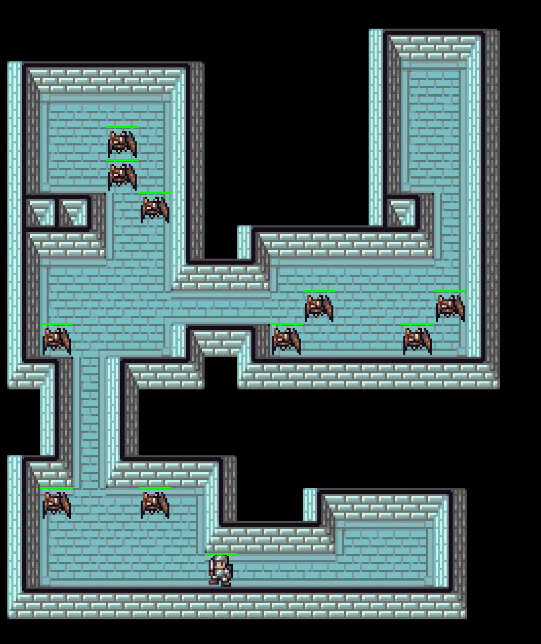
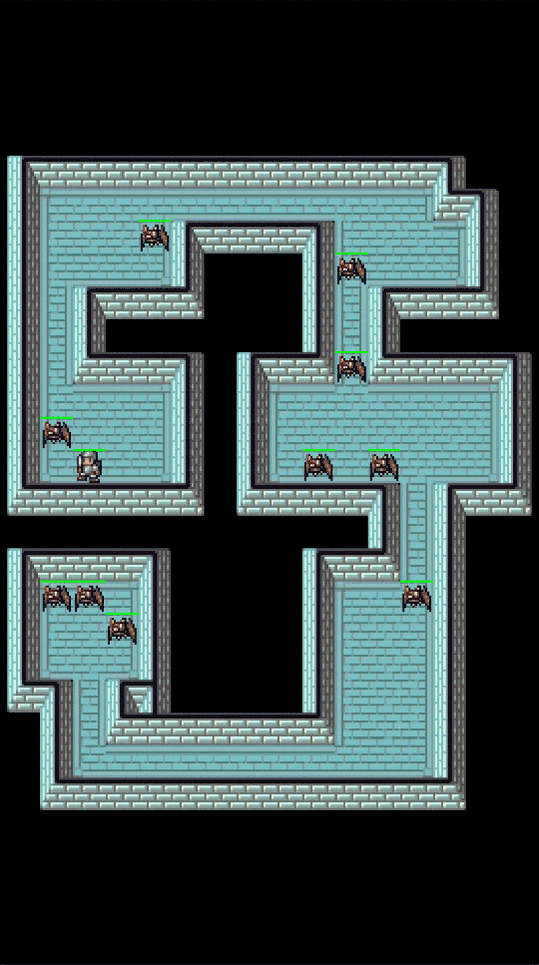

# Tiny Rogue

Tiny Rogue is a roguelike gameplay prototype made with [Unity Project Tiny](https://docs.unity3d.com/Packages/com.unity.tiny.all@latest) for mobile and web. The dungeon is procedurally generated with binary space partitioning (BSP). There is another dedicated [dungeon generator](https://github.com/NagaChiang/unity-ecs-bsp-dungeon-generation) project made with Unity ECS/DOTS.

